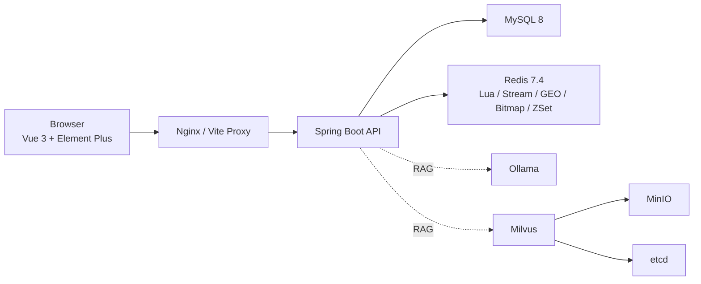

# zwz-hmdp | 高并发秒杀、探店与本地知识库 RAG 平台

[](https://spring.io/projects/spring-boot)
[](https://vuejs.org/)
[](https://redis.io/)
[](https://www.mysql.com/)
[](https://docs.docker.com/compose/)
[](./LICENSE)

一个围绕本地生活业务场景构建的全栈项目：核心是高并发秒杀、热点缓存、社交分发和附近商铺查询，附带一套基于本地文档知识库的最小可用 RAG 客服能力。

它不是“只有接口的练习仓库”，也不是“只讲思路不落代码”的笔记。这个仓库把 Lua 原子脚本、Redis Stream 异步下单、逻辑过期缓存、GEO 检索、Bitmap 签到、ZSet 点赞榜、Vue 3 管理台和 Docker Compose 运行环境放在了同一条可运行链路里。

## 为什么值得看

- **不是孤立知识点 demo**：秒杀、缓存、Feed、GEO、签到、RAG 都有对应实现和页面入口。
- **关键链路是完整的**：从前端请求到后端落库、缓存、异步消费、容器化运行，路径是打通的。
- **实现有工程约束**：秒杀资格判断前置到 Redis，订单异步消费走 Stream，热点缓存和穿透防护分策略处理，没有把高并发问题偷换成数据库热路径。
- **适合学习和二次改造**：目录分层清晰，后端 `controller -> service -> mapper`，前端 `pages/services/stores` 分工明确。

## 目录

- [技术栈](#技术栈)
- [核心能力](#核心能力)
- [架构总览](#架构总览)
- [快速开始](#快速开始)
- [本地开发](#本地开发)
- [RAG 模块说明](#rag-模块说明)
- [关键配置](#关键配置)
- [项目结构](#项目结构)
- [关键实现说明](#关键实现说明)
- [开发备注](#开发备注)
- [License](#license)

## 技术栈

| 层次         | 技术                                         | 作用                                                    |
| ------------ | -------------------------------------------- | ------------------------------------------------------- |
| 后端         | Java 21, Spring Boot 3.5, Spring MVC         | REST API、事务、配置管理                                |
| 持久层       | MyBatis Plus 3.5.7, MySQL 8                  | 业务数据落库与查询                                      |
| 缓存与中间件 | Redis 7.4, Redisson                          | 秒杀资格校验、缓存、签到、点赞榜、关注流、GEO、分布式锁 |
| 前端         | Vue 3, Vite, Vue Router, Pinia, Element Plus | 管理台页面、状态管理、接口联调                          |
| AI / 检索    | LangChain4j, Ollama, Milvus, MinIO, etcd     | 本地知识库索引与 RAG 对话                               |
| 运行环境     | Docker Compose, Nginx                        | 本地一键启动、前端静态托管、反向代理                    |

## 核心能力

| 能力       | 解决的问题                         | 仓库中的关键实现                                                                     |
| ---------- | ---------------------------------- | ------------------------------------------------------------------------------------ |
| 秒杀下单   | 防超卖、防重复下单、削峰           | `backend/src/main/resources/seckill.lua`、`VoucherOrderServiceImpl`、`RedisIdWorker` |
| 热点缓存   | 避免缓存击穿、穿透                 | `CacheClient.queryWithLogicalExpire()`、`queryWithPassThrough()`                     |
| 社交分发   | 点赞榜、关注关系、粉丝收件箱       | Redis `ZSet`、`Set`、`feed:{userId}`                                                 |
| 附近商铺   | 按距离排序并分页                   | Redis `GEO` + `order by field(id, ...)`                                              |
| 登录与签到 | 无 Session 登录态、低成本连续签到  | `authorization` token + Redis `Bitmap`                                               |
| 文档客服   | 本地知识库问答、重建索引、引用片段 | `RagServiceImpl`、`RagController`、`docs/rag/`                                       |

## 架构总览



### 这套架构重点保护了什么

- 秒杀资格判断不回退到数据库热路径。
- 订单消息不在请求线程内直接落库，而是通过 Redis Stream 异步消费。
- 热点数据过期时优先保证可读性，再异步重建缓存。
- 附近商铺查询优先用 Redis GEO 完成范围筛选和距离排序。
- RAG 模块与主业务解耦，不影响秒杀、探店等核心链路。

## 快速开始

### 方式一：Docker Compose 一键启动

要求：

- Docker
- Docker Compose

启动：

```bash
docker compose up -d --build
```

默认访问地址：

- 前端：<http://localhost:8080>
- 后端：<http://localhost:8081>

默认会启动这些服务：

- `mysql`
- `redis`
- `redis-init`：初始化 `stream.orders` 消费者组 `g1`
- `etcd`
- `minio`
- `milvus`
- `app`
- `frontend`

建议首次启动后按下面顺序验证：

1. 打开前端首页，确认工作台和登录页可访问。
2. 调用验证码登录接口，确认 Redis 和 MySQL 均已连通。
3. 创建或查询商铺，确认基础业务链路可用。
4. 如果要使用 RAG，再补齐 Ollama 模型并重建索引。

## 本地开发

### 1. 启动基础依赖

如果你只想本地跑代码，而不是整套容器，建议先启动中间件：

```bash
docker compose up -d mysql redis redis-init etcd minio milvus
```

### 2. 启动后端

```bash
cd backend
mvn spring-boot:run
```

### 3. 启动前端

```bash
cd frontend
yarn install
yarn dev
```

说明：

- 当前仓库同时存在 `yarn.lock` 和 `package-lock.json`，现有脚本和 Dockerfile 以 `yarn` 为准；如果任务涉及依赖安装或锁文件更新，建议继续沿用 `yarn`，避免无意义锁文件漂移。
- 前端开发环境会把 `/user`、`/shop`、`/blog`、`/voucher-order`、`/rag` 等接口代理到 `http://localhost:8081`。
- 登录 token 通过请求头 `authorization` 传递，不使用 Cookie Session。
- 开发环境启用了 `app.debug.echo-login-code=true`，验证码接口会直接回传验证码，方便联调。

## RAG 模块说明

这个仓库除了本地生活业务，还包含一个最小可用的文档知识库客服模块。

### 能做什么

- 扫描 `docs/rag` 目录中的文档
- 解析并切片 `pdf`、`md`、`txt`、`docx`
- 写入 Milvus 向量库
- 基于 Ollama 本地模型执行检索增强问答
- 在前端页面查看文档状态、最近任务、引用片段和会话回答

### 依赖什么

- 默认文档目录：`docs/rag`
- 默认对话模型：`qwen2.5:7b`
- 默认向量模型：`qwen3-embedding:0.6b`
- 默认 Ollama 地址：`http://localhost:11434`

如果你在宿主机安装了 Ollama，常见准备方式是：

```bash
ollama pull qwen2.5:7b
ollama pull qwen3-embedding:0.6b
```

### 使用建议

- 业务主链路不依赖 RAG；即使暂时不用知识库功能，也可以先跑通秒杀、商铺、博客、关注等模块。
- 文档内容尽量按“一个小节讲一件事”的方式组织，这样更利于切片和召回。仓库内有一份示例说明：[docs/rag/README.md](./docs/rag/README.md)。
- Docker Compose 中后端默认通过 `host.docker.internal:11434` 访问宿主机 Ollama。这个配置对 macOS / Windows 比较直接；如果你在 Linux 上运行，通常需要自行调整 `RAG_OLLAMA_BASE_URL`。

## 关键配置

常用环境变量如下：

| 变量                  | 默认值                   | 说明                   |
| --------------------- | ------------------------ | ---------------------- |
| `SERVER_PORT`         | `8081`                   | 后端端口               |
| `MYSQL_HOST`          | `127.0.0.1`              | MySQL 主机             |
| `MYSQL_PORT`          | `3306`                   | MySQL 端口             |
| `MYSQL_DATABASE`      | `hmdp`                   | 数据库名               |
| `MYSQL_USER`          | `root`                   | 数据库用户             |
| `MYSQL_PASSWORD`      | `root`                   | 数据库密码             |
| `REDIS_HOST`          | `localhost`              | Redis 主机             |
| `REDIS_PORT`          | `6379`                   | Redis 端口             |
| `RAG_ENABLED`         | `true`                   | 是否启用 RAG 相关 Bean |
| `RAG_DOCS_DIR`        | `docs/rag`               | 知识库文档目录         |
| `RAG_OLLAMA_BASE_URL` | `http://localhost:11434` | Ollama 地址            |
| `RAG_MILVUS_HOST`     | `127.0.0.1`              | Milvus 地址            |
| `RAG_MILVUS_PORT`     | `19530`                  | Milvus 端口            |

完整配置见 [backend/src/main/resources/application.yaml](./backend/src/main/resources/application.yaml)。

## 项目结构

```text
.
├── backend
│   ├── db/                               # 初始化 SQL
│   ├── src/main/java/com/hmdp
│   │   ├── config/                       # Redis、Redisson、RAG、MVC 配置
│   │   ├── controller/                   # REST API
│   │   ├── dto/                          # 请求/响应 DTO
│   │   ├── entity/                       # 实体
│   │   ├── interceptor/                  # Token 刷新、登录拦截
│   │   ├── mapper/                       # MyBatis Plus Mapper
│   │   ├── service/                      # 业务接口与实现
│   │   └── utils/                        # CacheClient、RedisIdWorker 等
│   ├── src/main/resources
│   │   ├── application.yaml
│   │   ├── seckill.lua
│   │   └── unlock.lua
│   └── Dockerfile
├── docs
│   └── rag/                              # RAG 文档知识库目录
├── frontend
│   ├── src
│   │   ├── components/
│   │   ├── layout/
│   │   ├── new_pages/                    # 新版 Element Plus 页面
│   │   ├── pages/                        # 现有页面入口
│   │   ├── router/
│   │   ├── services/
│   │   ├── stores/
│   │   └── styles/
│   ├── nginx.conf
│   ├── vite.config.js
│   └── Dockerfile
├── docker-compose.yml
└── README.md
```

## 关键实现说明

### 1. 秒杀链路为什么能抗住并发

秒杀入口不是“先查数据库库存再扣减”，而是先执行 Lua 脚本，在 Redis 内原子完成：

1. 库存校验
2. 一人一单校验
3. 库存扣减
4. 写入 `stream.orders`

之后由消费者线程异步创建订单，并在数据库落库前再用 Redisson 锁兜底，避免重复创建。

### 2. 热点缓存为什么不是简单设置 TTL

仓库把“缓存穿透”和“缓存击穿”分开处理：

- `queryWithPassThrough()`：用空值缓存拦截不存在数据
- `queryWithLogicalExpire()`：用逻辑过期 + 互斥锁 + 异步重建保护热点数据

这比单一 TTL 策略更贴近真实业务。

### 3. 附近商铺为什么先查 Redis 再回表

附近商铺查询依赖 Redis GEO 做范围检索和距离排序，然后再按 `order by field(id, ...)` 回表补全商铺信息。这样能同时保住：

- 距离排序
- 分页能力
- 避免数据库高频地理计算

### 4. RAG 模块为什么适合放在这个仓库里

它不是为了“给项目贴 AI 标签”，而是把一套常见的知识库检索链路补进现有平台：

- 文档扫描与切片
- 稠密检索 + 关键词召回
- 本地模型对话
- 引用片段回显
- 重建任务状态可视化

这让仓库同时覆盖了经典高并发场景和一个现代化的本地知识库场景。

## 开发备注

- 前端路由使用 Hash 模式，和当前 Nginx 回退配置配套。
- 秒杀关键路径依赖 `seckill.lua`、Redis Stream `stream.orders` 和 Redisson 锁，不建议绕过这些链路做“简化版”改造。
- 热点店铺缓存依赖 `CacheClient.queryWithLogicalExpire()`；不要把逻辑过期、空值缓存和简单删缓存混为同一种策略。
- 如果你通过 `docker compose` 访问前端，并计划从前端页面直接使用 RAG API，请检查 [frontend/nginx.conf](./frontend/nginx.conf) 中是否包含 `/rag` 反向代理规则；当前开发环境代理已覆盖 `/rag`，容器内 Nginx 配置需要与你的实际访问路径保持一致。

## License

Apache License 2.0，详见 [LICENSE](./LICENSE)。
