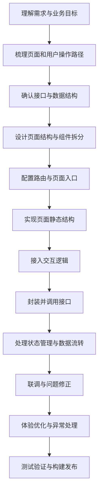

# 高并发电商秒杀平台

## 前端架构设计

### 1. 状态管理：sharedState

本项目采用**单一响应式状态对象**模式（类似 Pinia），所有全局状态集中在 `stores/sharedState.js`：

```javascript
export const sharedState = {
  token: ref(localStorage.getItem("hmdp-token") || ""), // 登录令牌
  currentUser: ref(null), // 当前登录用户
  apiBaseUrl: ref(""), // 后端 API 地址
  assetBaseUrl: ref(""), // 静态资源地址
  shopTypes: ref([]), // 商铺分类缓存
  selectedShop: ref(null), // 当前选中商铺
  lastResponse: ref(null), // 最近接口响应
  requestLogs: ref([]), // 请求日志记录
  notice: reactive({ type: "info", message: "" }), // 全局通知
  loadingMap: reactive({}), // 加载状态映射
};
```

**状态更新模式：** 组件通过导入 `send()` 函数发起请求，回调中更新本地 `ref` 或全局状态。

**持久化策略：** `token`、`apiBaseUrl`、`uploadedImages` 等状态会写入 `localStorage`，页面刷新后自动恢复。

---

### 2. 路由设计：Vue Router

路由配置在 `router/index.js`，采用**嵌套路由 + 动态组件映射**：

```javascript
const routes = [
  {
    path: "/",
    component: AppShell, // 布局壳
    children: moduleMeta.map((item) => ({
      path: item.routePath,
      name: item.id,
      component: pageComponents[item.id], // 动态组件
      meta: { title: item.title, description: item.description },
    })),
  },
];
```

**模块元数据驱动：** 所有页面信息（路由路径、标题、描述、侧边栏配置）集中在 `config/moduleMeta.js`，路由和侧边栏同步生效，**新增页面只需在 moduleMeta 中添加一条配置**。

**路由特点：**

- 路由-path 与组件名的映射关系由 `moduleMeta` 统一维护
- 无需手动注册每个路由，`map()` 自动生成完整路由表
- 每个路由的 `meta` 携带标题和描述，用于侧边栏展示

---

### 3. 接口层封装：api.js

请求封装在 `api.js`，提供统一的 Axios 风格请求逻辑：

**核心函数：**

| 函数                         | 作用                                          |
| ---------------------------- | --------------------------------------------- |
| `createApiClient()`          | 创建 API 客户端实例，注入 baseURL 和 token    |
| `buildUrl()`                 | 拼接 baseURL + path + queryString             |
| `resolveAssetUrl()`          | 拼接静态资源完整 URL（处理相对路径/绝对路径） |
| `asNumber()` / `asBoolean()` | 类型转换工具                                  |
| `cloneWithoutEmpty()`        | 剔除空值字段                                  |
| `prettify()`                 | JSON 格式化输出                               |

**请求流程：**

```
组件调用 send(endpointKey, config)
  ↓
sharedState.send() 包装一层 loading + 日志 + 错误处理
  ↓
apiClient.request() 执行真实请求
  ↓
自动注入 authorization header（从 sharedState.token 获取）
  ↓
响应拦截：判断 businessSuccess，触发 onSuccess / onError 回调
```

---

### 4. 组件通信模式

**父→子：Props**

父组件向子组件传递数据：

```javascript
// 父组件
const user = ref({ id: 1, name: "测试用户" });
<ChildComponent :user="user" />
```

**子→父：Emit / 函数 Prop**

子组件通过 emit 通知父组件，或父组件传递回调函数：

```javascript
// 方式一：emit
const emit = defineEmits(["update"]);
emit("update", newValue);

// 方式二：函数 prop
const onUpdate = defineProps({ onUpdate: Function });
props.onUpdate(newValue);
```

**跨组件：共享状态**

多个组件共享 `sharedState` 中的状态（如 `token`、`currentUser`、`shopTypes`），通过直接读写状态对象实现同步。

---

### 5. 页面还原与数据流转

**页面初始化流程（以 ShopsPage 为例）：**

```
用户进入 /shops 路由
  ↓
AppShell 渲染侧边栏 + ShopsPage
  ↓
ShopsPage.onMounted() 或用户操作触发 query 函数
  ↓
send("GET /shop/of/type", config, {
  onSuccess: (data) => { shopsByType.value = data; }
})
  ↓
更新本地 ref 状态
  ↓
Vue 自动追踪依赖，模板中 {{ shopsByType }} 实时渲染
```

**表单提交流程：**

```
用户填写表单 → 点击提交
  ↓
调用 buildShopPayload(forms) 打包表单数据（剔除空值、类型转换）
  ↓
send("POST /shop", { body: payload }, {
  successMessage: "创建成功",
  onSuccess: () => { 重置表单 / 刷新列表 }
})
  ↓
sharedState.requestLogs.unshift(response) 记录日志
  ↓
页面展示成功通知
```

**数据转换层：** `buildShopPayload()`、`buildBlogPayload()` 等函数负责：

- 剔除用户未填写的空字段
- 字符串转数字（`asNumber`）
- 处理 `images` 逗号分隔格式
- 返回符合后端 DTO 结构的请求体

---

### 6. 前后端联调要点

**Base URL 配置：**

```javascript
// 默认指向 localhost:8081，可通过页面输入框修改
sharedState.apiBaseUrl.value = "http://localhost:8081";
```

**Token 注入：**

```javascript
// 登录成功后
sharedState.token.value = response.data;
localStorage.setItem("hmdp-token", token);

// 后续请求自动带上
requestHeaders.set("authorization", token);
```

**鉴权拦截：** 后端返回 401 时，`apiClient.onUnauthorized()` 回调会：

- 清除 `currentUser`
- 弹出错误通知

**空值与类型处理：**

```javascript
// 后端返回 null 或 []
data === null ? [] : data; // 根据接口实际行为选择
// 逗号分隔字符串转数组
images.value.split(",").filter(Boolean);
// 类型转换
asNumber("123"); // → 123
```

---

### 7. 页面与组件关系

| 组件                | 职责                                        |
| ------------------- | ------------------------------------------- |
| `AppShell.vue`      | 布局容器：侧边栏 + `<router-view>`          |
| `SidebarNav.vue`    | 导航菜单：根据 moduleMeta 动态渲染菜单项    |
| `HeroPage.vue`      | 环境配置、登录入口、模块入口展示            |
| `UserPage.vue`      | 验证码发送、登录/登出、签到、用户信息查询   |
| `ShopTypesPage.vue` | 分类列表、分类图片预览                      |
| `ShopsPage.vue`     | 商铺查询（按类型/名称）、商铺创建/更新/详情 |
| `BlogsPage.vue`     | 博客发布、热榜、点赞、关注流、用户博客      |
| `FollowPage.vue`    | 关注/取关、共同关注查询                     |
| `VouchersPage.vue`  | 普通券、秒杀券、秒杀下单                    |
| `UploadPage.vue`    | 图片上传、预览、删除                        |
| `LogsPage.vue`      | 接口覆盖矩阵、最近响应、请求日志            |

---

### 8. 请求日志与诊断

`sharedState.requestLogs` 维护最近 40 条请求记录，每条记录包含：

```javascript
{
  logId: "1711500000000-abc123",     // 唯一标识
  endpointKey: "GET /shop/of/type",  // 接口名
  displayTime: "14:30:25",           // 展示用时间
  request: { method, url, headers },  // 请求信息
  response: { status, body },         // 响应信息
  duration: 125,                      // 耗时 ms
}
```

LogsPage 组件以可视化表格展示这些日志，便于：

- 排查接口问题
- 验证接口覆盖完整性
- 复现用户操作路径

**基础设施：** Docker、Docker Compose、Maven

## 项目结构

```
hmdp/
├── backend/                          # 后端工程
│   ├── src/main/java/com/hmdp/       # Java 源码
│   │   ├── config/                   # 配置类
│   │   │   ├── MvcConfig.java
│   │   │   ├── MybatisConfig.java
│   │   │   ├── RedissonConfig.java
│   │   │   └── WebExceptionAdvice.java
│   │   ├── controller/               # 控制器层
│   │   ├── dto/                      # 数据传输对象
│   │   ├── entity/                   # 实体类
│   │   ├── interceptor/             # 拦截器
│   │   ├── mapper/                  # MyBatis Mapper 接口
│   │   ├── service/                 # 服务层
│   │   │   └── impl/                # 服务实现类
│   │   └── utils/                   # 工具类
│   │   └── HmDianPingApplication.java
│   ├── src/main/resources/          # 资源配置
│   │   ├── mapper/                  # MyBatis XML 映射文件
│   │   ├── application.yaml         # 应用配置
│   │   ├── seckill.lua              # 秒杀 Lua 脚本
│   │   └── unlock.lua               # 解锁 Lua 脚本
│   ├── src/test/java/               # 测试代码
│   ├── db/                          # 数据库脚本
│   │   └── hmdp.sql
│   ├── docker/                      # Docker 配置
│   │   └── redis/
│   │       └── redis.conf
│   ├── pom.xml                      # Maven 配置
│   └── Dockerfile                   # 后端镜像构建
├── docker-compose.yml               # Docker Compose 编排文件
└── README.md
```

## 后端接口调用文档

### 服务信息

- Base URL：`http://localhost:8081`
- 接口前缀：无统一 `/api` 前缀，以下路径均直接挂在根路径
- 默认响应类型：`application/json`
- 时间字段：后端使用 `LocalDateTime`，JSON 中通常是 `2022-10-09T00:00:00`
- 常见分页：`current` 默认 `1`，单页大小实际固定为 `10`

### 鉴权说明

- 登录成功后，`/user/login` 的 `data` 会返回 token 字符串
- 后续请求把 token 放到请求头：`authorization: <token>`
- 未登录访问受保护接口时，后端直接返回 HTTP `401`
- 免登录接口：
  - `/user/code`
  - `/user/login`
  - `/blog/hot`
  - `/shop/**`
  - `/shop-type/**`
  - `/upload/**`
  - `/voucher/**`
- 其余接口默认需要登录

### 通用返回结构

```json
{
  "success": true,
  "errorMsg": null,
  "data": {},
  "total": null
}
```

| 字段       | 类型             | 说明                                              |
| ---------- | ---------------- | ------------------------------------------------- |
| `success`  | `boolean`        | 是否成功                                          |
| `errorMsg` | `string \| null` | 失败时的错误信息                                  |
| `data`     | `any`            | 真实业务数据                                      |
| `total`    | `number \| null` | 仅少数分页接口可能使用，本项目大多数接口为 `null` |

### 前端对接注意

- `Blog.images`、`Shop.images` 都是逗号分隔字符串，不是数组
- `Blog.name`、`Blog.icon`、`Blog.isLike` 是后端查询时动态补充字段
- `Shop.distance` 只有按坐标查询商铺时才会返回
- `Voucher.stock`、`Voucher.beginTime`、`Voucher.endTime` 只在券列表接口里用于秒杀券展示
- `Result.ok()` 返回时 `data` 为 `null`
- 部分“空结果”返回 `[]`，部分返回 `null`，下文已按实际行为标注

### 接口总览

> 以下“接口数”按 `HTTP 方法 + 路径` 统计。

| 模块     | 基础路径         | 接口数 | 默认鉴权              |
| -------- | ---------------- | -----: | --------------------- |
| 用户     | `/user`          |      8 | 部分免登录            |
| 商铺     | `/shop`          |      5 | 免登录                |
| 商铺分类 | `/shop-type`     |      1 | 免登录                |
| 博客     | `/blog`          |      8 | 仅 `/blog/hot` 免登录 |
| 关注     | `/follow`        |      3 | 需要登录              |
| 优惠券   | `/voucher`       |      3 | 免登录                |
| 秒杀下单 | `/voucher-order` |      1 | 需要登录              |
| 上传     | `/upload`        |      2 | 免登录                |

### 用户接口 `user`

| 方法   | 路径               | 需要登录 | 主要参数                          | 返回 `data`        | 说明                                                             |
| ------ | ------------------ | -------- | --------------------------------- | ------------------ | ---------------------------------------------------------------- |
| `POST` | `/user/code`       | 否       | `Form/Query: phone`               | `null`             | 发送 6 位验证码，手机号不合法会返回失败                          |
| `POST` | `/user/login`      | 否       | `Body: { phone, code, password }` | `string`           | 返回 token。当前实现只校验 `phone + code`，`password` 未实际使用 |
| `POST` | `/user/logout`     | 是       | 无                                | `null`             | 接口已暴露，但当前固定返回失败：`功能未完成`                     |
| `GET`  | `/user/me`         | 是       | 无                                | `UserDTO`          | 获取当前登录用户                                                 |
| `GET`  | `/user/info/{id}`  | 是       | `Path: id`                        | `UserInfo \| null` | 查询用户详情，不存在时返回 `null`                                |
| `GET`  | `/user/{id}`       | 是       | `Path: id`                        | `UserDTO \| null`  | 查询用户基础信息，不存在时返回 `null`                            |
| `POST` | `/user/sign`       | 是       | 无                                | `null`             | 今日签到                                                         |
| `GET`  | `/user/sign/count` | 是s      | 无                                | `number`           | 返回当月截至今天的连续签到天数                                   |

#### 登录最小示例

```http
POST /user/login
Content-Type: application/json

{
  "phone": "13800138000",
  "code": "123456"
}
```

```json
{
  "success": true,
  "data": "0f4c0f8f0b5c4c6b9f54b2a1b3e8d123"
}
```

### 商铺接口 `shop`

| 方法   | 路径            | 登录 | 主要参数                           | 返回 `data`      | 说明                                                          |
| ------ | --------------- | ---- | ---------------------------------- | ---------------- | ------------------------------------------------------------- |
| `GET`  | `/shop/{id}`    | 否   | `Path: id`                         | `Shop`           | 查单个商铺，找不到时返回失败：`店铺不存在`                    |
| `POST` | `/shop`         | 否   | `Body: Shop`                       | `null`           | 新增商铺。成功后不返回新商铺 ID                               |
| `PUT`  | `/shop`         | 否   | `Body: Shop`                       | `null`           | 更新商铺，`id` 不能为空                                       |
| `GET`  | `/shop/of/type` | 否   | `Query: typeId, current=1, x?, y?` | `Shop[] \| null` | 不传坐标时普通分页；传 `x/y` 时按 GEO 距离排序并补 `distance` |
| `GET`  | `/shop/of/name` | 否   | `Query: name?, current=1`          | `Shop[]`         | 按名称模糊搜索                                                |

#### 商铺按类型查询最小示例

```http
GET /shop/of/type?typeId=1&current=1&x=120.149192&y=30.316078
```

```json
{
  "success": true,
  "data": [
    {
      "id": 1,
      "name": "103茶餐厅",
      "typeId": 1,
      "distance": 12.3
    }
  ]
}
```

### 商铺分类接口 `shop-type`

| 方法  | 路径              | 登录 | 主要参数 | 返回 `data`  | 说明               |
| ----- | ----------------- | ---- | -------- | ------------ | ------------------ |
| `GET` | `/shop-type/list` | 否   | 无       | `ShopType[]` | 按 `sort` 升序返回 |

### 博客接口 `blog`

| 方法   | 路径               | 登录 | 主要参数                  | 返回 `data`            | 说明                                         |
| ------ | ------------------ | ---- | ------------------------- | ---------------------- | -------------------------------------------- |
| `POST` | `/blog`            | 是   | `Body: Blog`              | `number`               | 发布探店笔记，返回博客 ID                    |
| `PUT`  | `/blog/like/{id}`  | 是   | `Path: id`                | `null`                 | 点赞/取消点赞，同一路径切换状态              |
| `GET`  | `/blog/of/me`      | 是   | `Query: current=1`        | `Blog[]`               | 当前登录用户的笔记                           |
| `GET`  | `/blog/hot`        | 否   | `Query: current=1`        | `Blog[]`               | 热门笔记。若携带 token，会补充 `isLike`      |
| `GET`  | `/blog/{id}`       | 是   | `Path: id`                | `Blog`                 | 查询笔记详情，不存在时返回失败：`博客不存在` |
| `GET`  | `/blog/likes/{id}` | 是   | `Path: id`                | `UserDTO[]`            | 点赞用户列表，当前实现最多返回 7 条          |
| `GET`  | `/blog/of/user`    | 是   | `Query: id, current=1`    | `Blog[]`               | 查看某个用户的笔记                           |
| `GET`  | `/blog/of/follow`  | 是   | `Query: lastId, offset=0` | `ScrollResult \| null` | 关注推送流，当前每次最多拉取 2 条            |

#### 发布博客最小示例

```http
POST /blog
authorization: <token>
Content-Type: application/json

{
  "shopId": 1,
  "title": "周末探店",
  "images": "/imgs/1.jpg,/imgs/2.jpg",
  "content": "环境很好，值得再来。"
}
```

```json
{
  "success": true,
  "data": 17
}
```

#### 关注推送流最小示例

```http
GET /blog/of/follow?lastId=1711500000000&offset=0
authorization: <token>
```

```json
{
  "success": true,
  "data": {
    "list": [
      {
        "id": 17,
        "title": "周末探店"
      }
    ],
    "minTime": 1711499999000,
    "offset": 1
  }
}
```

### 关注接口 `follow`

| 方法  | 路径                      | 登录 | 主要参数             | 返回 `data` | 说明                                       |
| ----- | ------------------------- | ---- | -------------------- | ----------- | ------------------------------------------ |
| `PUT` | `/follow/{id}/{isFollow}` | 是   | `Path: id, isFollow` | `null`      | `isFollow=true` 表示关注，`false` 表示取关 |
| `GET` | `/follow/or/not/{id}`     | 是   | `Path: id`           | `boolean`   | 是否已关注该用户                           |
| `GET` | `/follow/common/{id}`     | 是   | `Path: id`           | `UserDTO[]` | 共同关注列表，空时返回 `[]`                |

### 优惠券接口 `voucher`

| 方法   | 路径                     | 登录 | 主要参数        | 返回 `data` | 说明                                                               |
| ------ | ------------------------ | ---- | --------------- | ----------- | ------------------------------------------------------------------ |
| `POST` | `/voucher`               | 否   | `Body: Voucher` | `number`    | 新增普通券，返回券 ID                                              |
| `POST` | `/voucher/seckill`       | 否   | `Body: Voucher` | `number`    | 新增秒杀券，返回券 ID，需同时传 `stock / beginTime / endTime`      |
| `GET`  | `/voucher/list/{shopId}` | 否   | `Path: shopId`  | `Voucher[]` | 查询店铺可用券列表；秒杀券会混合返回 `stock / beginTime / endTime` |

### 秒杀下单接口 `voucher-order`

| 方法   | 路径                          | 登录 | 主要参数   | 返回 `data` | 说明                                                                    |
| ------ | ----------------------------- | ---- | ---------- | ----------- | ----------------------------------------------------------------------- |
| `POST` | `/voucher-order/seckill/{id}` | 是   | `Path: id` | `number`    | 发起秒杀下单，成功返回订单 ID；失败常见文案：`库存不足`、`禁止重复下单` |

#### 秒杀下单最小示例

```http
POST /voucher-order/seckill/10
authorization: <token>
```

```json
{
  "success": true,
  "data": 1624774384923137
}
```

### 上传接口 `upload`

| 方法   | 路径                  | 登录 | 主要参数         | 返回 `data` | 说明                                                     |
| ------ | --------------------- | ---- | ---------------- | ----------- | -------------------------------------------------------- |
| `POST` | `/upload/blog`        | 否   | `FormData: file` | `string`    | 上传博客图片，返回文件相对路径，如 `/blogs/1/2/uuid.png` |
| `GET`  | `/upload/blog/delete` | 否   | `Query: name`    | `null`      | 删除博客图片，`name` 必须是返回的文件名/相对路径         |

#### 图片上传最小示例

```http
POST /upload/blog
Content-Type: multipart/form-data

file=<二进制文件>
```

```json
{
  "success": true,
  "data": "/blogs/7/14/4771fefb-1a87-4252-816c-9f7ec41ffa4a.jpg"
}
```

### 关键数据结构速查

#### `UserDTO`

```json
{
  "id": 1,
  "nickName": "小鱼同学",
  "icon": "/imgs/blogs/blog1.jpg"
}
```

#### `ScrollResult`

```json
{
  "list": [],
  "minTime": 1711499999000,
  "offset": 1
}
```

#### `Voucher` 列表中的秒杀字段

```json
{
  "id": 10,
  "shopId": 1,
  "title": "100元代金券",
  "type": 1,
  "stock": 100,
  "beginTime": "2022-10-09T00:00:00",
  "endTime": "2022-10-10T20:00:00"
}
```

### 已知坑点与未完成项

- `BlogCommentsController` 已存在，但当前没有任何可调用接口
- `/user/logout` 当前未实现，调用后会返回：

```json
{
  "success": false,
  "errorMsg": "功能未完成"
}
```

- `/user/login` 虽然请求体里有 `password` 字段，但当前代码只校验验证码登录
- `/shop/of/type` 在坐标分页模式下，如果超过可分页范围，后端可能返回 `data: null`，不是空数组
- `/blog/of/follow` 没有传统 `page/size`，要使用 `lastId + offset` 做滚动分页
- 图片上传接口只返回相对文件路径，前端展示图片时需要按实际部署环境拼接静态资源访问地址

## Vue3 前端开发流程

本项目的前端基于 **Vue 3 + Vite** 开发，主要负责页面展示、交互逻辑、路由跳转、接口调用、登录态维护，以及与后端业务接口进行联调。

这一节不讲具体代码怎么写，而是从“一个功能从开始到完成”这个视角，帮助你理解前端的完整开发流程。

### 一、先理解前端在项目中的职责

在这个项目里，前端不是简单把接口数据展示出来，而是承担以下几类职责：

- 把后端提供的业务能力转成用户可操作的页面
- 组织页面结构、组件关系和交互流程
- 发起接口请求，并处理成功、失败、空状态、加载状态
- 维护登录态、用户态、列表态、表单态等页面数据
- 根据后端返回结构，把数据加工成页面真正需要的形式
- 在联调阶段发现接口和页面之间的契约问题，并推动修正

可以把它理解为：**后端负责“提供能力”，前端负责“把能力变成用户体验”。**

---

### 二、Vue3 前端开发总流程



这张图表示的是一个完整功能从需求到交付的典型前端路径。实际开发时，很多步骤会来回迭代，但总体顺序基本就是这样。

---

### 三、详细流程说明

### 1. 理解需求与业务目标

前端开发的第一步不是写页面，而是先弄清楚：

- 这个功能是给谁用的
- 用户要完成什么操作
- 页面最终要解决什么问题
- 成功路径是什么，失败路径是什么
- 哪些行为必须登录，哪些可以游客访问

以本项目为例，像“登录”“商铺列表”“博客点赞”“秒杀下单”这些功能，虽然都要做页面，但它们面对的用户目标完全不同：

- 登录功能的目标是完成身份校验并拿到 token
- 商铺列表的目标是快速浏览和筛选信息
- 博客点赞的目标是即时反馈用户互动结果
- 秒杀下单的目标是高并发场景下稳定触发购买流程

如果这一步没想清楚，后面做出来的页面通常只是“能看”，但不一定“能用”。

---

### 2. 梳理页面和用户操作路径

确认需求后，前端要把需求翻译成页面流程。

这一阶段主要解决：

- 这个功能对应几个页面
- 页面之间如何跳转
- 一个页面里有哪些操作入口
- 点击按钮之后发生什么
- 哪些信息需要回填、刷新、跳转或提示

例如一个完整的前端功能，通常会拆成这样的用户路径：

1. 用户进入页面
2. 页面初始化拉取数据
3. 用户进行搜索、筛选、点赞、提交、购买等操作
4. 前端发起请求
5. 页面根据结果更新视图
6. 必要时跳转到下一个页面或提示结果

前端开发本质上就是把这条路径设计得清晰、自然、可控。

---

### 3. 确认接口与数据结构

当页面路径明确后，就要和后端接口对齐。

在这个项目里，前端对接时尤其要注意这些接口约定：

- 通用返回结构是 `success / errorMsg / data / total`
- 登录成功后，需要把 token 放到请求头 `authorization`
- 部分接口需要登录，部分接口免登录
- 一些字段并不是前端天然想要的格式，例如 `images` 是逗号分隔字符串，而不是数组
- 部分空结果返回 `null`，而不是空数组

这一步前端要完成的不是“记接口地址”，而是明确下面这些问题：

- 请求参数是什么
- 返回数据是什么结构
- 页面真正要用哪些字段
- 是否需要数据转换
- 是否有分页、滚动加载、坐标查询、鉴权等特殊逻辑

简单说，**接口不是拿来直接展示的，接口数据通常需要被前端理解、筛选、加工之后，才能变成页面状态。**

---

### 4. 设计页面结构与组件拆分

接口确认后，前端开始设计页面结构。

这一阶段主要考虑：

- 哪些是页面级模块
- 哪些适合拆成可复用组件
- 哪些区域只负责展示
- 哪些区域负责交互和业务逻辑
- 状态应该放在页面、组件还是全局层面

一个成熟的 Vue3 项目，通常会把前端结构拆成几层：

- **页面层**：负责组织页面、承接路由、组合业务模块
- **组件层**：负责复用界面片段，如列表项、卡片、弹窗、表单区块
- **接口层**：负责统一封装请求
- **状态层**：负责用户信息、登录态、共享数据等跨页面状态
- **工具层**：负责通用格式化、校验、转换逻辑

这一层拆得清楚，后面开发和维护都会顺很多。

---

### 5. 配置路由与页面入口

Vue3 项目一般会通过路由管理页面跳转。

这一阶段要明确：

- 页面入口路径是什么
- 哪些页面需要登录后访问
- 登录后要跳到哪里
- 页面之间如何传参
- 是整页跳转，还是局部切换

路由在前端项目里不仅是“地址映射”，它还承担：

- 页面切换控制
- 权限拦截
- 页面层级组织
- 用户操作路径串联

所以开发一个功能时，页面能不能正常展示只是第一步，**能不能在整个用户路径里顺畅流转**，往往取决于路由设计是否合理。

---

### 6. 先实现静态页面结构

正式开发时，建议先把页面静态结构搭出来，再逐步接入数据和交互。

这一步主要完成：

- 页面框架布局
- 列表、表单、按钮、弹窗、筛选区等基础结构
- 各模块在页面中的位置和层级
- 交互区域和展示区域的划分

这样做的好处是：

- 页面骨架先稳定下来
- 更容易和产品或后端确认信息展示是否合理
- 后续接接口时不会边写结构边改逻辑，混乱度更低

你可以把它理解为：**先把“页面长什么样”确定，再去接“页面怎么动”。**

---

### 7. 接入交互逻辑

静态结构完成后，前端开始接交互。

交互包括但不限于：

- 输入框输入
- 按钮点击
- 列表切换
- 点赞、关注、下单、登录等用户动作
- 弹窗打开关闭
- 标签切换、分页切换、筛选条件变化

这一阶段要重点想清楚的是：

- 谁触发动作
- 动作会改哪些状态
- 动作完成后页面哪里需要刷新
- 用户操作失败时如何提示
- 是否需要防重复点击、防抖、节流或加载锁定

尤其像秒杀、点赞、登录提交这类动作，前端除了发请求，还要保证用户感知是可控的，例如按钮状态、加载态、结果提示、重复提交限制等。

---

### 8. 封装并调用接口

交互逻辑准备好后，就进入接口接入阶段。

这一阶段的核心不是“把接口调通”这么简单，而是建立一套稳定的数据请求流程：

- 请求从哪里发起
- 请求参数怎么组织
- token 怎么自动带上
- 错误怎么统一处理
- 成功结果怎么分发到页面
- 是否需要二次封装和字段转换

结合本项目，前端通常需要特别关注：

- 登录后 token 的保存和后续注入
- 未登录访问接口时的处理方式
- `success=false` 时如何展示 `errorMsg`
- `data=null` 和 `data=[]` 的差异处理
- 像 `images` 这类特殊字段如何转换成页面更好使用的格式

这一阶段做得好，后面页面维护成本会低很多。

---

### 9. 处理页面状态和数据流转

在 Vue3 开发中，真正决定页面是否稳定的，往往不是页面长得漂不漂亮，而是状态是否清晰。

前端通常会面对几类状态：

- **请求状态**：未加载、加载中、成功、失败
- **数据状态**：列表数据、详情数据、分页数据、表单数据
- **用户状态**：是否登录、当前用户信息、token 是否有效
- **交互状态**：弹窗开关、选中项、当前 tab、当前筛选条件
- **共享状态**：多个页面或组件都要用的数据

开发时要想清楚：

- 什么状态只属于当前组件
- 什么状态属于整个页面
- 什么状态应该全局共享
- 状态更新后哪些视图会联动刷新

如果状态边界模糊，页面很容易出现这些问题：

- 一个操作更新了数据，但页面不刷新
- 切换页面后状态残留
- 多个组件各自维护一份重复数据
- 登录态失效后页面还显示旧信息

所以前端开发流程里，**状态设计是核心环节，不是补充环节。**

---

### 10. 前后端联调

当页面和接口都准备得差不多之后，就进入联调阶段。

联调时通常会验证：

- 参数名是否一致
- 字段类型是否一致
- 页面预期和接口真实返回是否一致
- 登录态是否能正常贯穿
- 异常时页面提示是否符合预期
- 边界场景是否正常，例如空列表、无权限、接口失败、重复点击

在这个项目里，联调尤其要关注：

- token 是否正确携带在 `authorization` 请求头中
- 部分接口免登录、部分接口必须登录
- `null` 和空数组是否被页面正确识别
- 秒杀、点赞、关注等即时操作是否会正确回刷页面
- 详情页、列表页、分页页之间的数据是否一致

联调不是“最后看看能不能跑”，而是前端把页面假设和后端真实能力对齐的关键阶段。

---

### 11. 体验优化与异常处理

功能跑通之后，还不能立刻算开发完成。还需要补齐体验层面的内容。

这一阶段前端通常要完善：

- 加载中提示
- 提交中禁用按钮
- 空数据占位
- 错误提示文案
- 请求失败重试或返回策略
- 页面切换时的数据保留或重置
- 图片、列表、滚动区域的显示体验

一个真正成熟的前端页面，不只是“能拿到数据”，而是无论成功、失败、慢、空、重复点击，都能给用户清晰反馈。

---

### 12. 测试验证与构建发布

开发完成后，前端还要做最后的验证和交付准备。

通常包括：

- 自测核心用户路径是否完整
- 验证登录、退出、列表、详情、提交等关键流程
- 验证不同接口返回下页面是否正常
- 验证构建是否成功
- 验证静态资源、接口地址、环境配置是否正确

如果项目接入了自动化流程，还会包含：

- 代码检查
- 构建检查
- 打包产物验证
- 部署环境联调

前端开发并不是页面写完就结束，而是要确认：**用户真的可以完整地走完这条业务路径。**

---

### 四、结合本项目，可以把前端开发理解成三条主线

为了方便理解，你可以把整个 Vue3 前端开发流程总结成三条并行主线：

#### 1. 页面主线

负责解决“页面怎么展示、怎么交互、怎么跳转”。

#### 2. 数据主线

负责解决“数据从哪里来、怎么转换、怎么更新、怎么同步”。

#### 3. 用户主线

负责解决“用户当前处于什么状态、能做什么、操作后得到什么反馈”。

一个功能开发是否成熟，往往就看这三条主线有没有同时打通。

---

### 五、完整前端功能的落地顺序

如果你要开发一个新的 Vue3 页面或功能，推荐按下面顺序推进：

1. 先理解业务目标和用户路径
2. 明确页面需要哪些接口和字段
3. 设计页面结构、组件关系和路由入口
4. 完成静态页面搭建
5. 接入页面交互
6. 封装并对接接口
7. 处理状态、鉴权、异常、空态、加载态
8. 完成前后端联调
9. 做体验优化和边界检查
10. 完成构建验证并交付

---
